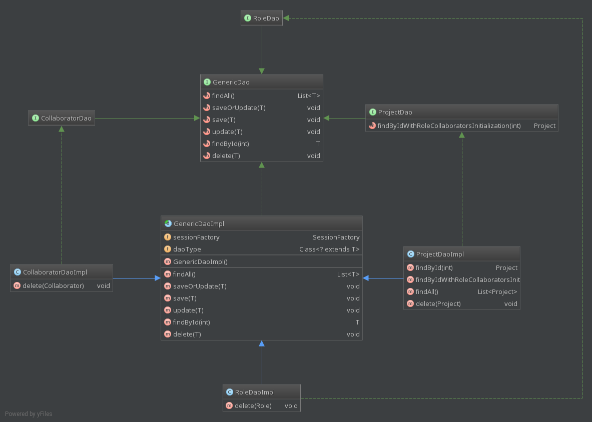

# Techdegree project 7
### InstaTeam with Spring and Hibernate

### Table of Contents
### Installation instructions
* [Eclipse installation instructions.] (#eclipse)

### Misc
- [Structure of the project] (#structure)
- [Quick Links to files and directories] (#links)

### Tasks
* [1.] (#task-1) 
    In the IDE of your choice, create a Gradle project. Add 
    dependencies for 
    Spring Boot with Thymeleaf, Spring ORM, Hibernate, Apache DBCP, and H2. 
    Create the directory and package structure of the application. Save all 
    static assets into the proper project directory.
    

* [2.] (#task-2) 
    Create the configuration files for Hibernate and an H2 database connection.
    

* [3.] (#task-3) 
    Create a Java class for starting the application as a `SpringApplication` 
    and a Spring configuration class with two `@Bean` methods:
    - Method for initializing a `LocalSessionFactoryBean`
    - Method for initializing a `DataSource`
    

* [4.] (#task-4) 
    Create the `Role` model class, which represents the roles each project could 
    contain, and that need to be filled. Each role will have the following 
    pieces of information associated with it:
    - `id`: auto-generated numeric identifier to serve as the table’s primary 
        key
    - `name`: alphanumeric, reader-friendly name to be displayed. Example 
        role names might be “developer”, “designer”, or “QA engineer”. 
        This is a required field for data validation.
    - Getters and setters for all fields
    - Default constructor

    

* [5.] (#task-5) 
    Create the `Collaborator` model class, which represents a person who 
    is a candidate for working on any given project. Each collaborator 
    should contain the following:
    - `id`: auto-generated numeric identifier to serve as the table’s primary 
        key
    - `name`: first and last name of the collaborator. This is a required field 
        for data validation.
    - `role`: the single `Role` object that represents this collaborator’s skill. 
        For proper data association, it’s important to keep in mind that 
        there could be `many` collaborators associated with any `one` role. 
        This is a required field for data validation.
    - Getters and setters for all fields
    - Default constructor

    

* [6.] (#task-6) 
    Create the `Project` model class, which represents a project for which a 
    project manager is seeking collaborators. 
    Each project should contain the following:
    - `id`: auto-generated numeric identifier to serve as the table’s primary 
        key
    - `name`: alphanumeric, reader-friendly name to be displayed. 
        This is a required field for data validation.
    - `description`: longer description of the project. 
        This is a required field for data validation.
    - `status`: alphanumeric status of the project, 
        for example “recruiting” or “on hold”
    - `rolesNeeded`: collection of Role objects representing all 
        roles needed for this project, regardless of whether or not 
        they’ve been filled. For proper data association, keep 
        in mind that there could be `many` projects that contain `many` `Role` 
        objects. That is, each project can have many roles that 
        it needs, and each role can be needed by many projects.
    - `collaborators`: collection of `Collaborator` objects representing any 
        collaborators that have been assigned to this project. 
        For data association, use the fact that there could be `many` 
        projects that contain `many` Collaborator objects. 
        That is, each project can have many 
        collaborators, and each collaborator 
        can work on many projects.
    - Getters and setters for all fields
    - Default constructor

    

* [7.] (#task-7) 
    Add JPA annotations to all model classes.
    

* [8.] (#task-8) 
    Create a DAO interface and implementation for each model class.
    

* [9.] (#task-9) 
    Create a service interface and implementation for each model class. 
    

* [10.] (#task-10) 
    Create the `RoleController` and Thymeleaf views necessary for viewing, 
    adding, and editing roles.
    

* [11.] (#task-11) 
    Create the `CollaboratorController` and Thymeleaf views 
    necessary for viewing, 
    adding, and editing collaborators.
    

* [12.] (#task-12) 
    Create the `ProjectController` and Thymeleaf views necessary for viewing, 
    adding, and editing projects, without including the ability to 
    assign each role to a specific collaborator.
    

* [13.] (#task-13) 
    Add the methods to `ProjectController`, and the Thymeleaf views 
    necessary for assigning and unassigning collaborators to and from a 
    project’s needed roles.
    

### Extra Credit
* [14.] (#task-14) 
    Extract the common code of each DAO implementation to an abstract class 
    that the DAO implementations extend.
    

* [15.] (#task-15) 
    Add the ability to delete projects, roles, and contractors and 
    ensure data integrity for all relationships. 
    For example, when a collaborator is deleted, make sure that all 
    roles previously assigned to this collaborator become unassigned.
    

* [16.] (#task-16) 
    Include a start date on projects, and sort chronologically by start date on 
    the project index view.
    

<!--Links-->

<!--External URLs-->
[spark_blog_readme]: 
    https://github.com/nikiforov-alexander/pt4-spark-blog#eclipse "https://github.com/nikiforov-alexander/pt4-spark-blog#eclipse"
[codesenior_generic_dao_service_impl]:
    http://www.codesenior.com/en/tutorial/Spring-Generic-DAO-and-Generic-Service-Implementation "http://www.codesenior.com/en/tutorial/Spring-Generic-DAO-and-Generic-Service-Implementation"
[dzone_automatic_restart]:
    https://dzone.com/articles/continuous-auto-restart-with-spring-boot-devtools "https://dzone.com/articles/continuous-auto-restart-with-spring-boot-devtools"
[timestamp_h2]:
    http://www.h2database.com/html/datatypes.html#timestamp_type "http://www.h2database.com/html/datatypes.html#timestamp_type"
<!--Directories-->
[data]: data "data directory with H2 Database"
[resources]:
    src/main/resources "directory with static resources, application properties file and hibernate configuration file: src/main/resources"
[templates]:
    src/main/resources/templates "Thymeleaf templates directory: src/main/resources/templates"
[static]:
    src/main/resources/static "Static assets directory: src/main/resources/static"
[css]:
    src/main/resources/static/css "Directory with CSS files: src/main/resources/static/css"
[initial_project_files]:
    initial-project-files "directory with initial project files from Treeshouse"

<!--Files-->
[instateam.mv.db]: 
    data/instateam.mv.db "H2 databased used in project: instateam.mv.db"
[h2-1.4.192.jar]:
    h2-1.4.192.jar "H2 database jar file, used to launch server h2-1.4.192.jar"

<!--Configuration files-->
[hibernate.cfg.xml]: 
    src/main/resources/hibernate.cfg.xml "Hibernate configuration file: src/main/resources/hibernate.cfg.xml"
[application.properties]:
    src/main/resources/application.properties "Spring application properties file: application.properties"
[build.gradle]:
    build.gradle "Gradle configuration file: build.gradle"
<!--JavaScript files-->
[app.js]:
    src/main/resources/static/app.js "JavaScript file with all JavaScript functions used: src/main/resources/static/app.js"
[favicon.ico]:
    src/main/resources/static/favicon.ico "Icon used in tabs of the website: src/main/resources/static/favicon.ico"

<!--CSS files-->
[normalize.css]:
    src/main/resources/static/css/normalize.css "Normalize CSS, unchanged: src/main/resources/static/css/normalize.css"
[site.css]:
    src/main/resources/static/css/site.css "Main CSS file with custom styles added by me: src/main/resources/static/css/site.css"

<!--Eclipse files-->
[.project]:
    .project "Eclipse .project file, generated by IntellijIdea"
[.userlibraries]:
pt7-instateam-spring-with-hibernate.userlibraries "Eclipse .userlibraries file, generated by IntellijIdea: pt7-instateam-spring-with-hibernate.userlibraries"

<!--Thymeleaf template files-->
[layout.html]:
    ./src/main/resources/templates/layout.html "./src/main/resources/templates/layout.html"
[error.html]:
    ./src/main/resources/templates/error.html "./src/main/resources/templates/error.html"
[index.html]:
    ./src/main/resources/templates/index.html "./src/main/resources/templates/index.html"
[project-details.html]:
    ./src/main/resources/templates/project/project-details.html "./src/main/resources/templates/project/project-details.html"
[project-edit.html]:
    ./src/main/resources/templates/project/project-edit.html "./src/main/resources/templates/project/project-edit.html"
[project-collaborators.html]:
    ./src/main/resources/templates/project/project-collaborators.html "./src/main/resources/templates/project/project-collaborators.html"
[collaborator-details.html]:
    ./src/main/resources/templates/collaborator/collaborator-details.html "./src/main/resources/templates/collaborator/collaborator-details.html"
[collaborators.html]:
    ./src/main/resources/templates/collaborator/collaborators.html "./src/main/resources/templates/collaborator/collaborators.html"
[role-details.html]:
    ./src/main/resources/templates/role/role-details.html "./src/main/resources/templates/role/role-details.html"
[roles.html]:
    ./src/main/resources/templates/role/roles.html "./src/main/resources/templates/role/roles.html"

<!--Classes-->
[RoleTest]:
    ./src/test/java/com/techdegree/instateam/model/RoleTest.java "./src/test/java/com/techdegree/instateam/model/RoleTest.java"
[RoleService]:
    ./src/main/java/com/techdegree/instateam/service/RoleService.java "./src/main/java/com/techdegree/instateam/service/RoleService.java"
[CollaboratorServiceImpl]:
    ./src/main/java/com/techdegree/instateam/service/CollaboratorServiceImpl.java "./src/main/java/com/techdegree/instateam/service/CollaboratorServiceImpl.java"
[CollaboratorService]:
    ./src/main/java/com/techdegree/instateam/service/CollaboratorService.java "./src/main/java/com/techdegree/instateam/service/CollaboratorService.java"
[GenericService]:
    ./src/main/java/com/techdegree/instateam/service/GenericService.java "./src/main/java/com/techdegree/instateam/service/GenericService.java"
[RoleServiceImpl]:
    ./src/main/java/com/techdegree/instateam/service/RoleServiceImpl.java "./src/main/java/com/techdegree/instateam/service/RoleServiceImpl.java"
[ProjectServiceImpl]:
    ./src/main/java/com/techdegree/instateam/service/ProjectServiceImpl.java "./src/main/java/com/techdegree/instateam/service/ProjectServiceImpl.java"
[GenericServiceImpl]:
    ./src/main/java/com/techdegree/instateam/service/GenericServiceImpl.java "./src/main/java/com/techdegree/instateam/service/GenericServiceImpl.java"
[ProjectService]:
    ./src/main/java/com/techdegree/instateam/service/ProjectService.java "./src/main/java/com/techdegree/instateam/service/ProjectService.java"
[Application]:
    ./src/main/java/com/techdegree/instateam/Application.java "./src/main/java/com/techdegree/instateam/Application.java"
[FlashMessage]:
    ./src/main/java/com/techdegree/instateam/web/FlashMessage.java "./src/main/java/com/techdegree/instateam/web/FlashMessage.java"
[CollaboratorController]:
    ./src/main/java/com/techdegree/instateam/web/controller/CollaboratorController.java "./src/main/java/com/techdegree/instateam/web/controller/CollaboratorController.java"
[ProjectController]:
    ./src/main/java/com/techdegree/instateam/web/controller/ProjectController.java "./src/main/java/com/techdegree/instateam/web/controller/ProjectController.java"
[RoleController]:
    ./src/main/java/com/techdegree/instateam/web/controller/RoleController.java "./src/main/java/com/techdegree/instateam/web/controller/RoleController.java"
[Role]:
    ./src/main/java/com/techdegree/instateam/model/Role.java "./src/main/java/com/techdegree/instateam/model/Role.java"
[ProjectStatus]:
    ./src/main/java/com/techdegree/instateam/model/ProjectStatus.java "./src/main/java/com/techdegree/instateam/model/ProjectStatus.java"
[Project]:
    ./src/main/java/com/techdegree/instateam/model/Project.java "./src/main/java/com/techdegree/instateam/model/Project.java"
[Collaborator]:
    ./src/main/java/com/techdegree/instateam/model/Collaborator.java "./src/main/java/com/techdegree/instateam/model/Collaborator.java"
[NotFoundException]:
    ./src/main/java/com/techdegree/instateam/exception/NotFoundException.java "./src/main/java/com/techdegree/instateam/exception/NotFoundException.java"
[ProjectDaoImpl]:
    ./src/main/java/com/techdegree/instateam/dao/ProjectDaoImpl.java "./src/main/java/com/techdegree/instateam/dao/ProjectDaoImpl.java"
[RoleDaoImpl]:
    ./src/main/java/com/techdegree/instateam/dao/RoleDaoImpl.java "./src/main/java/com/techdegree/instateam/dao/RoleDaoImpl.java"
[RoleDao]:
    ./src/main/java/com/techdegree/instateam/dao/RoleDao.java "./src/main/java/com/techdegree/instateam/dao/RoleDao.java"
[CollaboratorDao]:
    ./src/main/java/com/techdegree/instateam/dao/CollaboratorDao.java "./src/main/java/com/techdegree/instateam/dao/CollaboratorDao.java"
[GenericDaoImpl]:
    ./src/main/java/com/techdegree/instateam/dao/GenericDaoImpl.java "./src/main/java/com/techdegree/instateam/dao/GenericDaoImpl.java"
[GenericDao]:
    ./src/main/java/com/techdegree/instateam/dao/GenericDao.java "./src/main/java/com/techdegree/instateam/dao/GenericDao.java"
[CollaboratorDaoImpl]:
    ./src/main/java/com/techdegree/instateam/dao/CollaboratorDaoImpl.java "./src/main/java/com/techdegree/instateam/dao/CollaboratorDaoImpl.java"
[ProjectDao]:
    ./src/main/java/com/techdegree/instateam/dao/ProjectDao.java "./src/main/java/com/techdegree/instateam/dao/ProjectDao.java"
[AppConfig]:
    ./src/main/java/com/techdegree/instateam/config/AppConfig.java "./src/main/java/com/techdegree/instateam/config/AppConfig.java"
[DataConfig]:
    ./src/main/java/com/techdegree/instateam/config/DataConfig.java "./src/main/java/com/techdegree/instateam/config/DataConfig.java"

### Eclipse Installation instructions

 
I generated necessary [.project] and 
[.userlibraries] and added `apply plugin : 'eclipse'` line to
[build.gradle]. This time without `.classpath`(Decided to experiment).
I tested it once again: it worked. As always there is a problem with 
`BuildPath` in `Eclipse`.
So it is better to set `src/main/java` as a source in `BuildPath`
options, if `Eclipse` does not understand it. Here is a link to old
[Spark Blog README.md][spark_blog_readme] just in case. 
*Important*: Before run the app itself, we have to launch the Server.
This is done in the following way:
- On the classpath there is "H2" database jar file: [h2-1.4.192.jar]
- In order to launch server, one has to go to project directory:
    This is important, because pathway to database in [data] 
    directory is relative: `./data/instateam`, see 
    [hibernate.cfg.xml]. (Although I didn't try to run server from
    other directory - May be it will work too).
- And there run in terminal the following 
    `java -cp h2-1.4.192.jar org.h2.tools.Server`
- Then should be opened Firefox window, where one can look at how
    my database [instateam.mv.db] looks like, keeping in mind
    settings of [hibernate.cfg.xml]
    
    After that `bootRun` Gradle task can be executed to run the 
    application.

### Tasks
1. 
    In the IDE of your choice, create a Gradle project. Add 
    dependencies for 
    Spring Boot with Thymeleaf, Spring ORM, Hibernate, Apache DBCP, and H2. 
    Create the directory and package structure of the application. Save all 
    static assets into the proper project directory.
    

    Gradle project is successfully created. Properties can be found in
    [build.gradle] file. Following dependenices were added(
    for simplicity only packages names are mentioned):
    - `spring-boot-started-thymeleaf` : Spring Boot With Thymeleaf. 
    - `spring-boot-devtools`: for automatic restart try. For more on how it is
        done, see this [Article][dzone_automatic_restart].
    - `spring-orm`: Spring ORM
    - `hibernate-core`: Hibernate
    - `tomcat-dbcp` : Apache DBCP
    - `h2`: H2
    - `nekohtml` : library used in [application.properties],
        to make Thymeleaf templates HTML5 compliant 
    - `junit` : unit testing library

    

    Main package is called `com.techdegree.instateam`. Empty directories were
    created automatically by IntellijIdea. Static assets are saved in
    [resources/static][static] directory. 
    Following files can be found there:
    - There is CSS directory [css],  with [normalize.css]
        and [site.css]
    - JavaScript file for application is called [app.js]
    - Website icon file : [favicon.png]

    

    Thymeleaf templates are in [resoures/templates][templates] directory.
    In resources directory Spring's [application.properties] file 
    and Hibernate's [hibernate.cfg.xml] can be found.

2. 
    Create the configuration files for Hibernate and an H2 database connection.
    

    Configuration file for Hibernate is called [hibernate.cfg.xml] 
    and situated in
    [resources] directory. 
     
    H2 properties for database(Driver, URL, username and password) are
    specified in Spring's [application.properties] file, 
    and then configured using
    `@Configuration` annotated [DataConfig] class. 

3.  
    Create a Java class for starting the application as a `SpringApplication` 
    and a Spring configuration class with two `@Bean` methods:
    - Method for initializing a `LocalSessionFactoryBean`
    - Method for initializing a `DataSource`

    

    Java class starting Spring application is created and 
    called [Application].
    Configuration file with two `@Bean` methods is created and
    called [DataConfig]: 
    - Method for initializing a `LocalSessionFactoryBean`exists and
      is called `sessionFactory`
    - Method for initializing a `DataSource` exists and is called
        `dataSource`

4.  
    Create the `Role` model class, which represents the roles each project could 
    contain, and that need to be filled. Each role will have the following 
    pieces of information associated with it:
    - `id`: auto-generated numeric identifier to serve as the table’s primary 
        key
    - `name`: alphanumeric, reader-friendly name to be displayed. Example 
        role names might be “developer”, “designer”, or “QA engineer”. 
        This is a required field for data validation.
    - Getters and setters for all fields
    - Default constructor

    

    [Role] model class exists. Following fields are there
    - `int id`: is auto-generated using `GenerationType.IDENTITY` and 
        annotated as `@Id` to be primary key for table "roles"
        associated. *NOTE*: It has type `int`, not surrounded by 
        wrapper. I know that, later it will be
        changed, when the application will be testable enough to
        accept changes easily.
    - `String name`: is annotated as `@NotNull` and has alphanumeric
        `@Pattern` annotation, with `message` displayed upon
        validation in [RoleController], whenever user is typing
        wrong name.
    - `List<Collaborator> collaborators`. This column is mapped
        by "role", creating `@OneToMany` relationship with 
        `Collaborator` class, which means that foreign key
        `role_id` is added as column in `collaborators` 
        table.
        It is fetched lazily, when we need to get 
        all collaborators associated with specific roles. This
        is used in `ProjectController.editProjectCollaborators`
        method, where user is picking collaborators for 
        projects' roles.
    - `List<Project> projects`. This column is mapped by role
        creating a `@ManyToMany` relationship with `Project`
        class. The link table would be "projects_roles". This
        never used in a form `role.getProjects` for now
        because there is no such page. This collection is
        fetched lazily. But nowhere I wrote a code to 
        initialize it.
    - Getters and Setters for all fields are added.
    - Default constructor for JPA is there
    - I also added `equals` and `hashCode` here,
        including `id` and `name` for checking.

5.  
    Create the `Collaborator` model class, which represents a person who 
    is a candidate for working on any given project. Each collaborator 
    should contain the following:
    - `id`: auto-generated numeric identifier to serve as the table’s primary 
        key
    - `name`: first and last name of the collaborator. This is a required field 
        for data validation.
    - `role`: the single `Role` object that represents this collaborator’s skill. 
        For proper data association, it’s important to keep in mind that 
        there could be `many` collaborators associated with any `one` role. 
        This is a required field for data validation.
    - Getters and setters for all fields
    - Default constructor

    

    [Collaborator] class is created. It contains:
    - `int id`: is auto-generated using `GenerationType.IDENTITY` and 
        annotated as `@Id` to be primary key for table "collaborators"
        associated. *NOTE*: It has type `int`, not surrounded by 
        wrapper. I know that, later it will be
        changed, when the application will be testable enough to
        accept changes easily.
    - `String name`: is annotated as `@NotNull` and has alphanumeric
        `@Pattern` annotation, with `message` displayed upon
        validation in [CollaboratorController], whenever user is typing
        wrong name.
    - `Role role`: is annotated with `@ManyToOne`, according to task.
        There is no annotations for `@Pattern` or something like
        that. Role is select using `option` tag. Collaborator can
        be unassigned, in this case his "role_id" column will be
        set to `null`.
    - There are getters and setter for all fields
    - There is a default constructor
    - *NOTE*: there is no member `projects`, defining bi-directional
        `@ManyToMany` relationship, simply because it is not needed.

6.  
    Create the `Project` model class, which represents a project for which a 
    project manager is seeking collaborators. 
    Each project should contain the following:
    - `id`: auto-generated numeric identifier to serve as the table’s primary 
        key
    - `name`: alphanumeric, reader-friendly name to be displayed. 
        This is a required field for data validation.
    - `description`: longer description of the project. 
        This is a required field for data validation.
    - `status`: alphanumeric status of the project, 
        for example “recruiting” or “on hold”
    - `rolesNeeded`: collection of Role objects representing all 
        roles needed for this project, regardless of whether or not 
        they’ve been filled. For proper data association, keep 
        in mind that there could be `many` projects that contain `many` `Role` 
        objects. That is, each project can have many roles that 
        it needs, and each role can be needed by many projects.
    - `collaborators`: collection of `Collaborator` objects representing any 
        collaborators that have been assigned to this project. 
        For data association, use the fact that there could be `many` 
        projects that contain `many` Collaborator objects. 
        That is, each project can have many 
        collaborators, and each collaborator 
        can work on many projects.
    - Getters and setters for all fields
    - Default constructor

    

    [Project] class is created. It contains the following:
    - `int id`: is auto-generated using `GenerationType.IDENTITY` and 
        annotated as `@Id` to be primary key for table "projects"
        associated. *NOTE*: It has type `int`, not surrounded by 
        wrapper. I know that, later it will be
        changed, when the application will be testable enough to
        accept changes easily.
    - `String name`: is annotated as `@NotNull` and has alphanumeric
        `@Pattern` annotation, with `message` displayed upon
        validation in [ProjectController], whenever user is typing
        wrong name.
    - `String description`: I didn't put any restrictions here,
        only `@NotNull` one. I could put `@Min` to define max
        number of symbols. But I had to test app manually, so
        I ended up creating new Project over and over again.
        So I removed everything from now. When I get unit
        testing in this project, I'll add `@Min`, for example.
    - `List<Role> rolesNeeded`: This is a collection of roles.
        It is connected with `projects` member of [Role] in 
        bi-directional manner. It is
        fetched lazily, whenever `findById` or 
        `findByIdWithRoleCollaboratorsInitialization` is
        called. `Project.rolesNeeded` and `Role.projects`
        are connected in "projects_roles" table, by
        primary keys. Upon deletion of project, role
        link is deleted from the table, and vice versa.
        For more see [Data Integrity](#task-15)
    - `List<Collaborator> collaborators`: This is a collection
        of collaborators. It is connected as `@ManyToMany` 
        collection 
        in uni-directional manner, because [Collaborator]
        does not have `projects`. The relationship is
        described in `@JoinTable` "projects_collaborators"
        by primary keys from both tables. It is fetched lazily
        and just like `rolesNeeded` is instantiated lazily, when
        project is called using `findById` and 
        `findByIdWithRoleCollaboratorsInitialization`
        methods. Upon deletion of project, `project_id` rows
        from link table "projects_collaborators" are removed,
        and vice versa, when collaborator is removed,
        rows with that collaborators `collaborator_id` are
        removed. For more on that see 
        [Data Integrity](#task-15).
        Collaborators are also removed from link table, 
        when role of these collaborators is removed.
    - `ProjectStatus status`: This is `@Enumerated` 
        member, which comes in "projects" table as 
        a number. [ProjectStatus] is `enum` and for 
        now has three values:
        - `ACTIVE`
        - `ARCHIVED`
        - `NOT_FOUND`
        Every one of them represents status of the project,
        defines CSS style with `style` member to show project 
        tag beautifully, see
        index page and detail page, also has `color`
        and `description` members. JavaScript in [app.js]
        is used to colorify options and select when 
        used picks up one or another status.
    - `Date dateCreated`: This is `java.util.Date` that is
        converted to [TIMESTAMP][timestamp_h2] type in H2 database 
        table. It is used to sort projects by creation date on index
        page, see [ProjectServiceImpl] and [Task 16](#task-16)
        for more. It is displayed
        both on [index.html] page and [project-details.html] page.

7.  
    Add JPA annotations to all model classes.
    

    JPA annotations added to all model classes:
    - [Role]
    - [Project]
    - [Collaborator]

8.  
    Create a DAO interface and implementation for each model class. 
    

    Following DAO interfaces and implementations created for model 
    classes:
    - [RoleDao], [RoleDaoImpl]
    - [CollaboratorDao], [CollaboratorDaoImpl]
    - [ProjectDao], [ProjectDaoImpl]

9.  
    Create a service interface and implementation for each model class. 
    

    Following service interfaces and implementations created for model 
    classes:
    - [RoleService], [RoleServiceImpl]
    - [CollaboratorService], [CollaboratorServiceImpl]
    - [ProjectService], [ProjectServiceImpl]

10. 
    Create the `RoleController` and Thymeleaf views necessary for viewing, 
    adding, and editing roles.
    

    [RoleController] is created with following methods:
    - `listRoles`: (GET request) 
        generating [All roles page][roles.html].
    - `addNewRole`: (POST request) 
        method, saving new role to database.
        Redirects to [All roles page][roles.html]
    - `roleDetails`: (GET request)
        method, generating 
        [role details page][role-details.html].
    - `editRole`: (POST request)
        method, updating existing role.
        Redirects to [All roles page][roles.html]
    - `deleteRole`: (GET request)
        method, deleting existing role.
        Redirects to [All roles page][roles.html]
        *NOTE*: I think I should change this to
        POST, because GET doesn't change anything whereas
        POST does, and HTML has GET and POST only, so this
        is one of the things to do when testing of the site
        will be up.
    

    Thymeleaf related views are:
    - All roles page: [roles.html]
    - role details page: [role-details.html]

11. 
    Create the `CollaboratorController` and Thymeleaf views 
    necessary for viewing, 
    adding, and editing collaborators.
    

    [CollaboratorController] is created with following methods:
    - `listCollaborators`: (GET request) method, listing all
        collaborators in database, generates 
        [All collaborators page][collaborators.html]
    - `addNewCollaborator`: (POST request) method, saving new
        collaborator to database. Redirects to
        [All collaborators page][collaborators.html]
    - `saveCollaboratorsRoles`: (POST request) method, saving
        collaborators' new roles. User can change many roles
        or only one on [All collaborators page][collaborators.html].
        To the same page this request is redirected.
    - `collaboratorDetails`: (GET request) method, generating
        [collaborator details page][collaborator-details.html]
    - `collaboratorNotFound`: (Exception handler) method, generating
        [error.html] page, with 404 status and "not found" message.
    - `saveOrUpdateCollaborator`: (POST request) method that is
        saving or updating collaborator. Well it is actually updates
        the collaborator, so this has to be changed in future.
        Redirects to [All collaborators page][collaborators.html].
    - `deleteCollaborator`: (GET request) method, deleting collaborator
        from database. Will be changed to POST in future.
        Redirects to [All collaborators page][collaborators.html].
    

    Thymeleaf related views are:
    - All collaborators page : [collaborators.html]
    - collaborator details page : [collaborator-details.html]

12. 
    Create the `ProjectController` and Thymeleaf views necessary for viewing, 
    adding, and editing projects, without including the ability to 
    assign each role to a specific collaborator.
    

    - `listProjects`(GET request) method, listing all projects on
        [Home page][index.html]. Returns [Home page][index.html]
    

    - `addNewProject`(GET request) method, saving new project
        to database. It redirects to [roles page][roles.html]
        if no roles are available in database. 
        Returns [Add new project page][project-edit.html]
    

    - `saveNewProject`(POST request, address "/projects/add-new")
       method  saving new project to database. Redirect
       upon success to [Home page][index.html] 
    

    - `generateSynchronizedWithAllRolesRolesNeededList` -
        private method used in `editProject`
    

    - `editProject`(GET request, address "/projects/{projectId}/edit")
        method generating project edit page. Returns same 
        [Add new project page][project-edit.html] but
        with different `action` in `form`.
    

    - `generateDisappearedRolesNeededArray` -
        private method used in `saveExistingProject` 
        method.
    

    - `saveExistingProject`(POST request, address "/projects/save")
        method updating existing project. Redirects to
        [Home page][index.html]
    

    - `generateSynchronizedWithRolesNeededCollaboratorsList` -
        private method used in `projectDetails` and 
        `editProjectCollaborators`
    

    - `projectDetails`(GET request, address "/projects/{projectId}/details")
        method generating [project detail page][project-details.html].
    

    - `editProjectCollaborators`(GET request, 
        address "/projects/{projectId}/collaborators")
        method, generating 
        [project collaborators page][project-collaborators.html]
    

    - `saveCollaboratorsForProject`(POST request,
        address "/projects/save-collaborators")
        method, saving project collaborators, redirects
        upon success to [project detail page][project-details.html].
        Address will be changed, 
        because it does not contain {projectId}.
    

    - `deleteProject`(GET request, address "/projects/{projectId}/delete")
        method removing project from database. Later will be changed to
        POST method. redirects to [Home page][index.html].
    

    - `projectNotFound` (Exception handler). For now is used when
        in any method [NotFoundException] is thrown.
    

    Related Thymeleaf views:
    - Home page: [index.html].
    - project detail page: [project-details.html].
    - project collaborators page: [project-collaborators.html]
    - Add new project page: [project-edit.html]  

13. 
    Add the methods to `ProjectController`, and the Thymeleaf views 
    necessary for assigning and unassigning collaborators to and from a 
    project’s needed roles.
    

    Related methods are:
    - `editProjectCollaborators`
    - `saveCollaboratorsForProject`
    

    For the description see [Task 12](#task-12)

### Extra Credit
14. 
    Extract the common code of each DAO implementation to an abstract class 
    that the DAO implementations extend.
    

    To say the truth my own capabilities were enough only to
    create [GenericDao] and [GenericService] interfaces that are
    inherited by all Daos and Service interfaces. The implementation
    of `abstract` [GenericDaoImpl] and [GenericServiceImpl] I found
    [here][codesenior_generic_dao_service_impl].
    I do understand perfectly well how [GenericDaoImpl] works:
    the main problem here was to initialize class instance
    in constructor, for more see comments. With the 
    [GenericServiceImpl] I don't feel so sure, but it works, and
    task is solved. Here also is the UML diagram picture of
    Dao/Service relationship:
    

